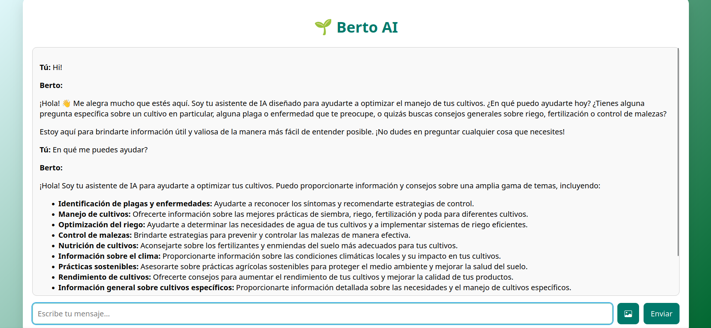
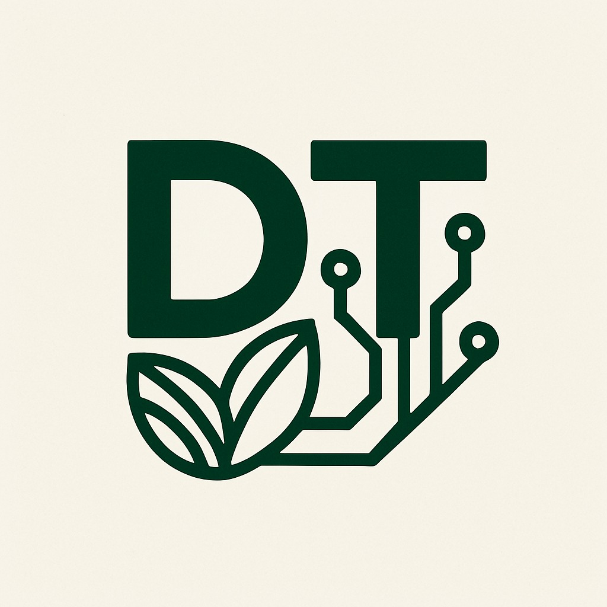

## **🌱Berto AI ChatBot**  
Made with Python and Flask, powered with Google Gemini 2.5 flash🤖  

---

  

---

## ES🇪🇸 
### ¿Qué es🤔?  
Berto AI🌱 es un chatbot inteligente parte del proyecto [AgroSync](https://github.com/hectop4/AgroSync/) desarrollado por el equipo de DeepThinkers para la hackatón TalentoTech 2025 del Ministerio TIC Colombia, el propósito de este proyecto es brindar una solución digital a los agricultores colombianos mediante la cual puedan gestionar de una manera más fácil sus cultivos, y gracias a Berto, tener un asistente inteligente siempre que lo requieran para consultar cualquier tipo de información referente a la agricultura.  

  

---

## Tecnologías y librerías usadas⌨️  
- [Python3.12.9🐍](https://www.python.org/)
- [Flask 3.1.1](https://flask.palletsprojects.com/en/stable/): micro framework de Python para desarrollo de aplicaciones web
- [gunicorn](https://pypi.org/project/gunicorn/): servidor web HTTP para applicaciones web en Python, escalable e ideal para entornos de producción
- asyncio: módulo por defecto de Python para manejar concurrencia y asincronismo
- jsonify: módulo para trabajar con envío de datos por medio de JSON
- [python-dotenv](https://pypi.org/project/python-dotenv/): librería para manejo de variables de entorno
- [requests](https://pypi.org/project/requests/): librería para el manejo de solicitudes HTTP
- [PyNaCl](https://pypi.org/project/PyNaCl/): implementación de la librería NaCl para encriptación de datos
- [pillow](https://pypi.org/project/pillow/): librería para el procesamiento de imágenes
- [google-api-python-client](https://pypi.org/project/google-api-python-client/): API de Google
- [google-generativeai](https://pypi.org/project/google-generativeai/): SDK oficial de Google para interactuar con sus LLMs por medio de su API

---

## EN🇬🇧 
### What is it🤔?  
Berto AI🌱 is a smart chatbot and part of the [AgroSync](https://github.com/hectop4/AgroSync/) project developed by the DeepThinkers team for the TalentoTech 2025 hackathon organized by the Ministry of ICT of Colombia. The purpose of this project is to provide a digital solution for Colombian farmers, allowing them to manage their crops more easily and, thanks to Berto, have an intelligent assistant available whenever they need to consult any kind of information related to agriculture.  

---

## Technologies and Libraries Used⌨️  
- [Python3.12.9🐍](https://www.python.org/)
- [Flask 3.1.1](https://flask.palletsprojects.com/en/stable/): a lightweight Python web framework for building web applications
- [gunicorn](https://pypi.org/project/gunicorn/): a scalable HTTP web server for Python web apps, ideal for production environments
- asyncio: Python’s built-in module for handling concurrency and asynchronous programming
- jsonify: a utility for working with JSON data in Flask
- [python-dotenv](https://pypi.org/project/python-dotenv/): a library for managing environment variables from .env files
- [requests](https://pypi.org/project/requests/): a library for making HTTP requests in Python
- [PyNaCl](https://pypi.org/project/PyNaCl/): a Python binding to the Networking and Cryptography (NaCl) library for data encryption
- [pillow](https://pypi.org/project/pillow/): a Python Imaging Library (PIL) fork used for image processing
- [google-api-python-client](https://pypi.org/project/google-api-python-client/): Google’s official API client for accessing Google services
- [google-generativeai](https://pypi.org/project/google-generativeai/): Google’s official SDK for interacting with their LLMs via API
